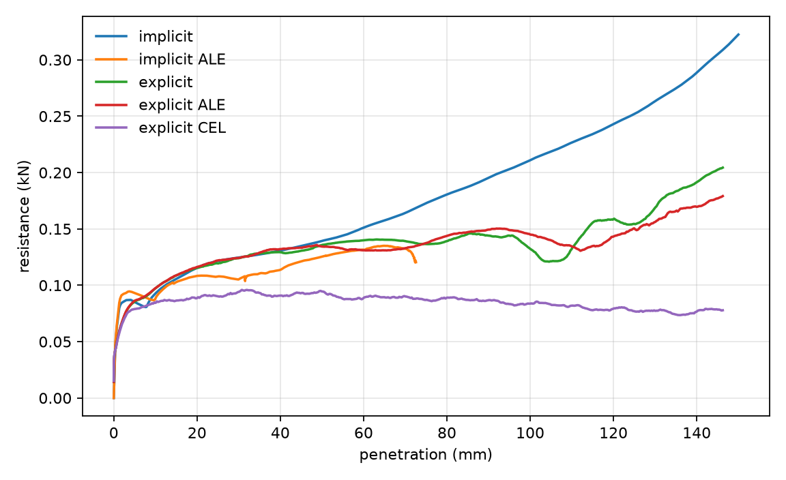

# fe-large-displacement

Abaqus models for large-displacement geotechnics.

## Start here

1. [`documentation/software.pdf`](documentation/software.pdf) — how to read the software.
2. [`documentation/formulations.pdf`](documentation/formulations.pdf) — what to change at each formulation.
3. Run `examples/implicit.py`.

```bash
set FLD_WORKDIR=C:\abq\run
set FLD_SUBMIT=0
abaqus cae noGUI=examples/implicit.py
```

`FLD_WORKDIR` must have no spaces if you compile a user subroutine.
`FLD_SUBMIT=0` writes the deck without solving. Omit it to submit.

## Models

| | |
|---|---|
| [`examples/implicit.py`](examples/implicit.py) | Abaqus/Standard, `*Static` |
| [`examples/implicit_ale.py`](examples/implicit_ale.py) | Standard + ALE |
| [`examples/explicit.py`](examples/explicit.py) | Abaqus/Explicit |
| [`examples/explicit_ale.py`](examples/explicit_ale.py) | Explicit + ALE |
| [`examples/explicit_cel.py`](examples/explicit_cel.py) | Explicit CEL |
| [`examples/suction_caisson.py`](examples/suction_caisson.py) | jacked then suction. No seepage. [Reading list](examples/suction_caisson.md) |

Each script is complete. Open two and diff them.

User subroutines live in [`constitutive/`](constitutive/). Using the Clausen Mohr-Coulomb model requires citing three papers; see that folder.



Resistance against penetration for the five indenters (same mesh, von Mises soil). Explicit force is a short moving average.

## Licence

MIT for the repository-authored files, except `constitutive/`. See [`NOTICE.md`](NOTICE.md).
